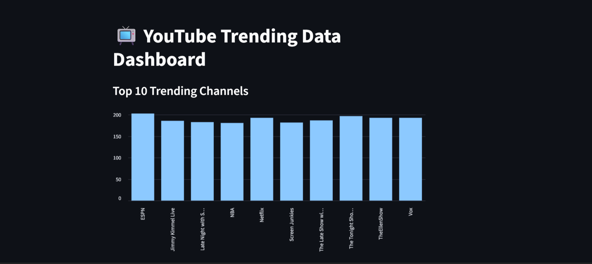

📺 YouTube Trending Data Pipeline & Dashboard

🚀 An end-to-end Data Engineering mini-project that extracts, transforms, and visualizes trending YouTube video data from multiple countries using Python, Pandas, and Streamlit.

📊 Features
- ✅ ETL Pipeline (Extract → Clean → Transform)
- ✅ Aggregated top trending creators & most-viewed videos
- ✅ Interactive dashboard with Streamlit
- ✅ Visual insights from real YouTube trending data

🖼️ App Screenshots

🔹 Homepage

🔹 Top Trending Channels Visualization

📂 Folder Structure

youtube-trend-pipeline/
├── data/ # Raw CSV data from Kaggle
├── scripts/ # ETL and analytics scripts
├── images/ # Screenshots for documentation
├── app.py # Streamlit dashboard
├── requirements.txt # Required Python packages
└── README.md # Project overview

 🚀 Live Demo

🔗 [Click to View Live App](https://your-streamlit-link)

💻 [GitHub Repository](https://github.com/yourusername/youtube-trend-pipeline)

🛠️ Tech Stack

- Python
- Pandas
- Streamlit
- Matplotlib
